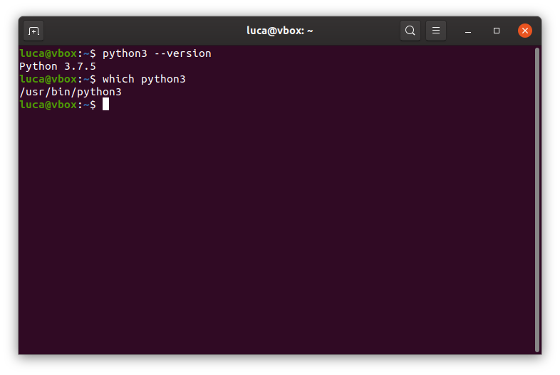

# yatap
Thi si Yet Another Tutorial About Python. It is not expected to be the best or the worse one. Jost another one.

## 1. Introduction
This guide covers basic information about the use of [Python](https://www.python.org/) on a GNU/Linux operating system. All procedures are tested on [Ubuntu 19.10](https://ubuntu.com/) virtualized by means of [VirtualBox](https://www.virtualbox.org/).

Two versions of Python will be considered:
* the one that comes preintalled with Manjaro (likely not the latest version)
* [Anaconda Python](https://www.anaconda.com/distribution/) distrubution in its minimal version [miniconda](https://docs.conda.io/en/latest/miniconda.html).

If you plan to use Python for scientific purposed, my advise is to use [Anaconda Python](https://www.anaconda.com/distribution/) distribution.

**Warning** In this tutorial I will use absolute path referring to my system and to my examples. For example, the home folder will always be `/home/luca` in my case. It's up to the reader adjust them according to their system settings. 


### 1.1 Some tips about VirtualBox
* Install the guest additions to have a better experience.
* shared clipboard works in Ubuntu 19.10 only if you manually install the package `virtualbox-guest-x11`
* To share a folder between your host OS and the guest OS follow this [link](https://help.ubuntu.com/community/VirtualBox/SharedFolders)

## 2. Installation of Python

### 2.1 Ubuntu preinstalled version
As the tile says, Ubuntu comes with a preinstalled Python version. Considering Ubuntu 19.10, this can be used opening a terminal and calling `python3` as shown in Fig. 1. One can se what Python distribution is preinstalled and where it is installed, as shown in Fig. 2, using the commands:

```bash
python --version
which python
```

<p align="center">

<br>
    <em>Fig.1 - example of use of `python3`.</em>
</p>

<p align="center">

<br>
    <em>Fig.2 - Ubuntu 19.10 Python preinstalled version.</em>
</p>

### 2.2 Miniconda
The installation procedure and the installer can be found [here](https://docs.conda.io/en/latest/miniconda.html). Here, I will summarize the main steps:

1. Download the installer (64 bit) from previus link or, alternatively, grab it with `wget`:

```bash
wget https://repo.anaconda.com/miniconda/Miniconda3-latest-Linux-x86_64.sh
```

2. Run the installer and follow the instruction:

```bash
bash Miniconda3-latest-Linux-x86_64.sh
```

3. Select the installation folder or let the installer decide (e.g. `/home/luca/moniconda3` in my case)
4. Let the installer initialize conda answering `yes` (see Fig.3)
5. Open a new terminal. You will notice the `(base)` environment active. I suggest to remove this default activation by running:
```
conda config --set auto_activate_base false
```
6. Check for possible update of conda with
```bash
conda update -n base -c defaults conda
```

Thats'it.

<p align="center">

<br>
    <em>Fig.3 - Miniconda: download and installer.</em>
</p>

<p align="center">

<br>
    <em>Fig.4 - Miniconda: installer.</em>
</p>


To verify the installation. Open a new terminal and run the following command:
```bash
# conda base environment should not be active.
# check again the preinstalled Python
python3 --version
which python

# now activate conda base environment
conda activate
# and check the Python version in use
python --version   # notice that the command is python and not python 3
which python
```

<p align="center">

<br>
    <em>Fig.5 - Verify miniconda installation.</em>
</p>

## 3. Configure a virtual environment
Most of the tutorial says that this step is optional. When I was approaching to Python I was used to skip this step because I did not catch completely the meaning of "the virtual environment thing". Today, I would strongly suggest to understand the meaning of a virtual environment and alwais use it.

### 3.1 Preinstalled Python
To create virtual environment you need another `python3-venv`:
```bash
sudo apt-get install python3-venv
```

Now I suggest to create, in your home folder, a new folder that will include all your virtual environments. I will call this folder `pyenv`.
```bash
mkdir ~/pyenv # "~" means home folder ('/home/luca' in my case)
```
Change directory to `pyenv`
```bash
cd ~/pyenv
```

Now, you can create a virtual environment with the following command. I will call the virtual environment `env_test`.
```bash
python3 -m venv env_test
```
You can verify that the environment is present by listing the files in the current folder:
```bash
ls -l
```

Now you can activate it and check the python version again.
```bash
source /home/luca/pyenv/env_test/bin/activate
python --version
which python
```
Remarks:
* of course you have to replace luca with your username
* notice that, even if you created the virtual environment with `python3`, inside the virtual environment you call Python with `python`.
* notice the location of the `python` intepreter in the virtual environment provided by `which python`. Please compare Fig. 6 with Fig. 2.

Finally, if you need to deactivate the environment you can run:
```bash
deactivate
```

<p align="center">

<br>
    <em>Fig.6 - Creating a virtual environment.</em>
</p>


### 3.2 Miniconda
With miniconda you do not need to take care about creating a folder for the virtual environment. `conda` takes care of this for you.

Due to some issue currently reletd to coda [(se here)](https://stackoverflow.com/questions/59345872/command-python-not-found-after-creating-conda-environment) it is not suggested to use the base comand to create an environment (`conda create -n conda_env`). Force insted the Python version to be installed in you environment. Also, currently Python 3.8 is available but not all conda packages are compatible. In the end, create an environment, here called `conda_env`, with the command:
```bash
conda create -n conda_env python=3.7
```
<p align="center">

<br>
    <em>Fig.7 - Creating a conda environment.</em>
</p>

As shown in Fig. 8, to activate the environment you need to run:
```bash
conda activate conda_env
```
and to deactivate it
```bash
conda deactivate
```

Again, you can check the Python version in use with:
```bash
python --version
which python
```
and deactivate it, eventually (see Fig. 8).

<p align="center">

<br>
    <em>Fig.8 - Check the conda envitonment.</em>
</p>

## 4. Install packages
If you are using virtual environment (and you should!) the first thing to do is to activate it.

### 4.1 Preinstalled Python
1. Activate the environment
```bash
source /home/luca/pyenv/env_test/bin/activate
```
2. Install the desired package with the Python installer package (`pip`):
```bash
pip install packege1 packege2 ... packege3
```
3. Let's try with some packages useful for scientific purposes: numpy scipy matplotlip and ipython.
```bash
pip install numpy scipy matplotlib ipython
```
4. Now with `pip` list you can check all packages in you environment
```bash
pip list
```
<p align="center">

<br>
    <em>Fig.9 - pip list.</em>
</p>

### 4.2 Miniconda
1. Activate the environment
```bash
conda activate conda_env
```
2. Install the desired package with `conda`
```bash
conda install packege1 packege2 ... packege3
```
3. Let's try with some packages useful for scientific purposes: numpy scipy matplotlip and ipython.
```bash
conda install numpy scipy matplotlib ipython
```
4. Now with `conda` list you can check all packages in you environment
```bash
conda list
```
<p align="center">

<br>
    <em>Fig.10 - conda list.</em>
</p>

## 5. Try the environment
This step is independent of the Python used. Activate your environment and type:
```bash
ipython
```
You are in ipython, a more versatile Python shell. Now import some libraries.
```python
import numpy as np # the handle arrays
import matplotlib.pyplot as plt # to make plot
plt.ion() # interactive plot enables
```

```python
x = np.array([1,2,3,4,5,6,7,8,9,10]) 
y = x ** 2  # y is x to the power of two 
plt.plot(x, y, 'C0-o') 
```

Now you can exit from the python interpreter tipying:
```python
exit
```

<p align="center">

<br>
    <em>Fig.11 - example of use.</em>
</p>

Not that the same output can be obtained writing a file (use whatever text editor) and listing all the command the in the file.

We can use vscodium that can be installed with this procedure:
```bash
wget -qO - https://gitlab.com/paulcarroty/vscodium-deb-rpm-repo/raw/master/pub.gpg | sudo apt-key add - 
```

```bash
echo 'deb https://gitlab.com/paulcarroty/vscodium-deb-rpm-repo/raw/repos/debs/ vscodium main' | sudo tee --append /etc/apt/sources.list.d/vscodium.list 
```

```bash
sudo apt update && sudo apt install codium
```

Now, we create a file called `example.py` with the exact same content used in the shell. After that, we open `ipython` at the location of the file and, we use:
```bash
run example.py
```

<p align="center">

<br>
    <em>Fig.12 - example of use.</em>
</p>


## 6. Install and use Python software not in the official repositories

### 6.1 Common steps
We refer to the [SpicePy](https://github.com/giaccone/SpicePy) Python software able to solve linear circuits. We will use git to download it. Hence run first `sudo apt-get install git`.

1. Open a terminal at a location where you want to store the software (e.g, we can create `ext_packages`)
```bash
mkdir ~/ext_packages
cd ~/ext_packages
```
2. clone the repository
```bash
git clone 
```
3. change directory to the project SpicePy and register the path
```bash
cd SpicePy
pwd
```
<p align="center">

<br>
    <em>Fig.13 - path of the software.</em>
</p>

### 6.2 Add the PATH of the software to the preinstalled Python
1. Go to this location
```bash
cd /home/luca/pyenv/env_test/lib/python3.7/site-packages/
```
2. Create a file named 'userpath.pth' including the path of your software. This can be done with any text editor but it can be done also with the terminal:
```bash
echo /home/luca/ext_packages/SpicePy > userpath.pth
```
3. check that the file exist
```bash
ls *.pth
```
4. activate your virtual environment (if it is not yet active)
```bash
source /home/luca/pyenv/env_test/bin/activate
```
5. run `ipython`
```bash
ipython
```
6. check that the path and look for the folder of your softeare
```python
import sys
sys.path
```
7. to double check, try to import `netlist.py`:
```python
import netlist as ntl
```

See Fig. 14 for a summary.

<p align="center">

<br>
    <em>Fig.14 - install SpicePy and make it visible to the preinstalled Python.</em>
</p>

### 6.3 Add the PATH of the software to conda
1. Go to this location
```bash
cd /home/luca/miniconda3/envs/conda_env/lib/python3.7/site-packages/
```
2. Create a file named 'userpath.pth' including the path of your software. This can be done with any text editor but it can be done also with the terminal:
```bash
echo /home/luca/ext_packages/SpicePy > userpath.pth
```
3. check that the file exist
```bash
ls *.pth
```
4. activate your virtual environment (if it is not yet active)
```bash
conda activate conda_env
```
5. run `ipython`
```bash
ipython
```
6. check that the path and look for the folder of your softeare
```python
import sys
sys.path
```
7. to double check, try to import `netlist.py`:
```python
import netlist as ntl
```

See Fig. 15 for a summary.

<p align="center">

<br>
    <em>Fig.15 - install SpicePy and make it visible to conda.</em>
</p>

### 6.4 Run all benchmark and some demo
Now SpicePy should be correctly installed. To be completely sure you can

**run all benchmarks:**
1. change the folder to
```bash
cd ~/ext_packages/SpicePy/benchmark/
```
2. run `ipython`
```bash
ipython
```
3. run the `benchmark.py`
```bash
run run_benchmark.py
```

See Fig. 16.

<p align="center">

<br>
    <em>Fig.16 - run benchmark.</em>
</p>

**run a single demo:**
1. change the folder to
```bash
cd ~/ext_packages/SpicePy/demo/
```
2. run one of the possible demo. See Fig.17 for two examples.

<p align="center">

<br>
    <em>Fig.17 - run benchmark.</em>
</p>


